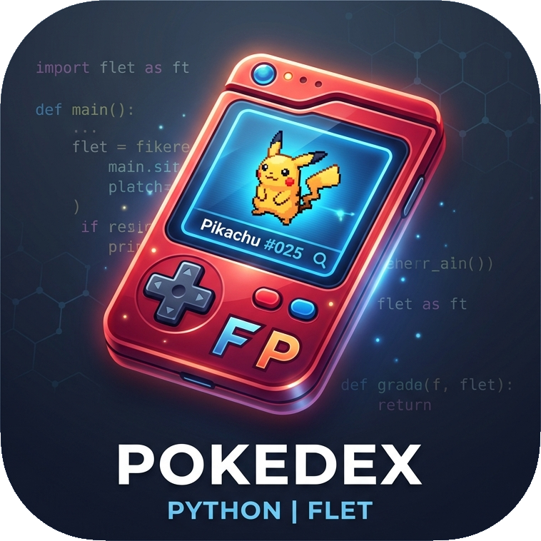

# Pokédex Flet



Pokédex interactiva de escritorio (y web, opcionalmente) construida con **Python + Flet**, consumiendo **PokeAPI**.

Proyecto basado en el [roadmap](Roadmap_Pokedex_Flet.md) `Roadmap_Pokedex_Flet.md`. Fases 0-15 completadas.

## Requisitos

- Python 3.14+
- [uv](https://docs.astral.sh/uv/)

## Instalación

```bash
uv sync
```

## Ejecución

```bash
uv run python main.py
```

## CLI de pruebas (Fase 2)

Puedes probar el cliente de PokeAPI desde la terminal:

```bash
uv run pokedex get-pokemon pikachu
uv run pokedex get-species pikachu
uv run pokedex get-evolution-chain pikachu
uv run pokedex get-generation 1
uv run pokedex generations
```

Equivalentemente: `uv run python -m app.cli get-pokemon pikachu`.

El cliente implementa reintentos (429/5xx y errores de red), concurrencia limitada con semáforo, paginación y manejo de respuestas inválidas.

## Calidad

```bash
uv run ruff check .      # lint
uv run mypy app          # type check
uv run pytest            # tests + cobertura (mín. 70 % en services/models)
```

`pytest` ejecuta `pytest-cov` con umbral de cobertura mínimo del **70 %** sobre
`app/services` y `app/models` (activo también en CI).

### Integración continua

Existe un pipeline de CI en `.github/workflows/ci.yml` (GitHub Actions) que
corre `ruff check`, `mypy` y `pytest` con cobertura en cada push a `main` y en
cada pull request.

### Fixtures

Los tests usan fixtures reales de PokeAPI almacenadas en `tests/fixtures/`
para ser deterministas y no depender de la red. Para regenerarlas:

```bash
uv run python scripts/download_fixtures.py
```

## Build y distribución (Fase 10)

La aplicación se empaqueta como ejecutable de escritorio con `flet build`.
Los metadatos de build (`product`, `org`, `company`, `description`) y las
exclusiones de empaquetado están configurados en `[tool.flet]` de
`pyproject.toml`; la versión se toma de `[project].version`.

> **Nota:** `flet build` requiere [Flutter](https://flutter.dev), que se
> descarga automáticamente en el primer build (necesario en máquinas con
> toolchains de compilación, p. ej. `cmake`, `clang`, `libgtk-3-dev`).

```bash
# Ejecutable Linux (también: windows, macos, web, apk, aab, ipa…)
uv run flet build linux -o dist
```

El ejecutable se genera en `dist/`. El workflow
`.github/workflows/release.yml` (GitHub Actions) compila el ejecutable Linux
en `ubuntu-latest` (que sí trae los toolchains), sube el artefacto y se lanza
al publicar una tag `v*` o manualmente desde la pestaña *Actions*.

### Distribución a usuarios

Para usuarios finales basta distribuir el ejecutable/directorio generado en
`dist/` (Linux: `dist/pokedex-flet`); no requiere Python ni dependencias
instaladas porque van empaquetadas dentro del binario.

## Estructura

```text
main.py                  # Entrypoint de la app Flet
app/
├── core/                # Config, logging, caché
├── models/              # Modelos Pydantic (Pokemon, Species, Generation, Evolution)
├── services/            # PokeAPIClient asíncrono + servicios con caché
├── state/               # Estado de la aplicación
└── ui/                  # Vistas y componentes Flet
tests/                   # Test unitarios
scripts/                 # Utilidades de desarrollo
assets/                  # Iconos e imágenes
```

## Roadmap

- [x] Fase 0: Entorno y esqueleto del proyecto.
- [x] Fase 1: Modelos, Python moderno, asyncio y logging.
- [x] Fase 2: Cliente PokeAPI, errores, reintentos, paginación y CLI.
- [x] Fase 3: Maqueta estática Flet con navegación simulada.
  - Componentes reutilizables: `PokemonCard`, `LoadingIndicator`, `ErrorMessage`, `StatBar`.
  - Navegación simulada entre generaciones y detalle falso al hacer click.
  - Toggle de tema oscuro/claro (reto extra).
- [x] Fase 4: MVP de búsqueda de Pokémon.
  - `TextField` + botón Buscar (Enter también busca); query normalizada
    (`strip().lower()`) y último término en `AppState.last_search`.
  - Búsqueda real contra PokeAPI vía `PokemonService.get_pokemon_with_species`
    con indicador de carga y botón deshabilitado mientras consulta.
  - Detalle real: sprite, nombre ES, tipos coloreados, descripción, altura,
    peso, habilidades y barras de stats.
  - Errores amigables: no encontrado (`PokemonNotFoundError`) y error de red
    con botón Reintentar.
  - `PokeAPIClient` inyectado desde `app.py` y cerrado en `on_disconnect`.
- [x] Fase 5: Lista interactiva de generaciones.
  - Generaciones reales desde `/generation` en el `NavigationRail` con nombre de región.
  - Lista de Pokémon de `/generation/{id}` (1 llamada, cacheada); sprites por ID sin llamadas extra.
  - Filtro local por nombre/ID y orden por ID o nombre.
  - Paginación local (50 por página) con botones Anterior/Siguiente.
  - Click en un Pokémon abre el detalle real (loading + errores con reintento).
  - Sprite placeholder para formas (ID ≥ 10000).
- [x] Fase 6: Vista de detalle completa con pestañas.
  - `PokemonService.get_pokemon_detail_full` carga Pokémon, especie y cadena
    evolutiva en paralelo (`asyncio.gather`), cacheada.
  - Pestañas (TabBar/TabBarView): Info, Stats, Evolución, Movimientos,
    Especie y Media.
  - Info: sprite con selector Normal/Shiny/Artwork sin recargar, tipos,
    descripción ES, experiencia, altura, peso y habilidades.
  - Stats: barras en orden estándar (hp→speed) con total.
  - Evolución: cadena clicable (navega al detalle de cada eslabón) con
    condición de evolución (nivel, objeto, intercambio, amistad…).
  - Movimientos: agrupados por método de aprendizaje (por nivel, MT/MO,
    huevo, tutor) y nivel en el método de nivel.
  - Especie: hábitat, color, forma, género (♂/♀ % desde `gender_rate`),
    grupo huevo, crecimiento, ratio de captura y generación.
  - Media: galería de sprites frontales/traseros (normal y shiny), artwork
    oficial y Home.
- [x] Fase 7: Evoluciones y relaciones avanzadas.
  - `EvolutionNode` ampliado con condiciones completas: `min_happiness`,
    `held_item`, `time_of_day`, `gender` (macho/hembra), `known_move`,
    `location`, `needs_overworld_rain` y `relative_physical_stats`.
  - Parser de `evolution_details` extrae todas las condiciones sin romper
    cadenas ramificadas (verificado con Eevee: 8 ramas, piedras y hora).
  - Flechas de evolución con condiciones legibles (nivel, objeto,
    intercambio, amistad, hora, género, movimiento, ubicación, lluvia).
  - Reto extra: tooltip con las condiciones completas al pasar el ratón
    por la flecha evolutiva.
- [x] Fase 8: Rendimiento, caché y experiencia de usuario.
  - Caché en disco de respuestas JSON con TTL en `~/.cache/pokedex-flet/api/`
    (`pokemon/…`, `pokemon-species/…`, `evolution-chain/…`, `generation`)
    en `PokeAPIClient._get`; la 2.ª apertura de un Pokémon no vuelve a la red.
  - Debounce de 300 ms en el buscador al escribir (cancela búsquedas previas
    con contador de generación).
  - Indicador de progreso (barra `ProgressBar`) al cargar listas grandes de
    generación.
  - Reto extra: modo offline con el botón de la AppBar (`cloud_off`) que lista
    solo Pokémon ya visitados (los cacheados en disco), mostrando nombre y
    sprite desde la caché sin red.
- [x] Fase 9: Testing, calidad y robustez.
  - Fixtures reales de PokeAPI en `tests/fixtures/` (`pokemon_25.json`,
    `pokemon-species_25.json`, `evolution-chain_10.json`, `generation_1.json`),
    regenerables con `scripts/download_fixtures.py`.
  - `conftest.py` carga los fixtures desde archivo (pruebas deterministas sin red).
  - Tests de parseadores, cliente HTTP (respx: 404, timeout, JSON inválido,
    reintentos), servicios (búsqueda, generación, evolución) y constructores UI.
  - Reto extra: cobertura con `pytest-cov` (umbral mínimo 70 %) sobre
    `app/services` y `app/models`.
  - Pipeline CI en GitHub Actions (`ruff`, `mypy`, `pytest`).
- [x] Fase 10: Empaquetado y distribución.
  - Metadatos de build Flet (`[tool.flet]`: `product`, `org`, `company`,
    `description`) y versionado desde `[project].version`.
  - Icono y nombre de aplicación; `CHANGELOG.md` con el historial de fases.
  - Workflow `release.yml` (GitHub Actions) que compila el ejecutable Linux en
    `ubuntu-latest` y sube el artefacto (disparable por tag `v*` o manual).
  - Documentación de instalación y build para usuarios finales.
- [x] Fase 11: Favoritos y persistencia local.
  - `LocalStore` (JSON atómico en `~/.local/share/pokedex-flet/local.json`):
    favoritos, últimos vistos e historial de búsqueda.
  - Botón de estrella en el detalle para (des)marcar favorito, botón
    «Favoritos» en la AppBar que lista los marcados.
  - Recientes: cada visita al detalle guarda el Pokémon; historial: cada
    búsqueda exitosa se recuerda.
- [x] Fase 12: Comparador de Pokémon.
  - `CompareService` + modelo `PokemonComparison` con dos lados (A/B).
  - Botón «Comparar» en la AppBar abre la vista de comparación. Los Pokémon
    A y B se eligen **desde la lista**: «Elegir A»/«Elegir B» te llevan a la
    lista para escoger cada uno.
  - Compara stats (barras lado a lado, ganador en verde, total), tipos,
    habilidades y cadenas evolutivas.
- [x] Fase 13: Tabla de tipos.
  - `TypeService` + modelo `TypeChartResult`: combina uno o dos tipos
    defensivos y calcula debilidades (x2/x4), resistencias (x0.5/x0.25),
    inmunidades (x0) y daño normal (x1) frente a los 18 tipos del juego
    (`/type/{type}`).
  - Vista «Tabla de tipos» desde la AppBar (botón GRID_ON): selector de uno o
    dos tipos y tabla visual con badges de color y multiplicadores.
- [x] Fase 14: Internacionalización (ES/EN).
  - Módulo `app.i18n`: catálogo bilingüe (más de 150 claves), `Translator`,
    `t()` con fallback a `es`/clave y `set_language()`.
  - Nombres y descripciones de especie localizados: `PokemonSpecies.names` y
    `descriptions` (dicts por idioma) con `localized_name(lang)` /
    `localized_description(lang)` y fallbacks.
  - Selector de idioma en la AppBar (botón TRANSLATE) que alterna ES/EN y
    re-renderiza la UI visible; la vista de detalle, comparador y tabla de
    tipos se muestran localizadas.
  - El comparador usa el idioma activo para los nombres (lang propagado por
    `CompareService.compare`).
- [x] Fase 15: Tema visual profesional.
  - Tipografía, `CardTheme` y `AppBarTheme` consistentes; la app arranca en el
    tema del sistema (botón de modo oscuro en la AppBar).
  - Skeleton loaders para lista y detalle (`app/ui/components/skeleton.py`).
  - Animación sutil de hover en las tarjetas de la lista (escala + sombra).
  - Colores por tipo de Pokémon en badges, comparador y tabla de tipos.
  - **Versión 0.2.0** (última fase del roadmap).

## Estado

Detalle completo con pestañas (info, stats, evolución, movimientos, especie y media) para cualquier Pokémon, con selector de sprite, cadena evolutiva navegable y condiciones completas con tooltip. Búsqueda con debounce, caché en memoria + disco, indicador de progreso y modo offline de Pokémon visitados. La app lista generaciones en vivo desde PokeAPI: navegación por región, lista filtrable y ordenable, paginación local y detalle real al hacer click. Favoritos persistentes (estrella en el detalle y botón en la AppBar), últimos vistos e historial de búsqueda guardados localmente en JSON. Comparador de dos Pokémon (stats con barras, tipos, habilidades y evoluciones) accesible desde la AppBar. Tabla de tipos (debilidades, resistencias, inmunidades y daño normal combinando uno o dos tipos) accesible desde la AppBar. La interfaz está completamente internacionalizada (ES/EN) con selector de idioma en la AppBar: nombres y descripciones de especie se muestran en el idioma activo con fallbacks. Tema visual profesional v0.2.0: tipografía consistente, modo oscuro (sigue al sistema), skeleton loaders mientras cargan listas y detalle, hover animado en tarjetas y colores por tipo en badges, comparador y tabla de tipos.